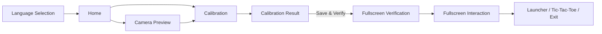
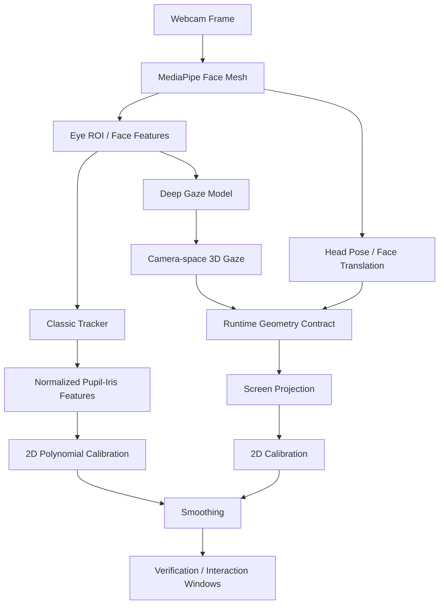
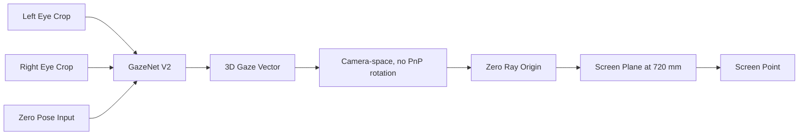

# Look2Act Tracker

<div align="center">

**Gaze-driven interaction with a standard webcam**

[](https://www.python.org/)
[](https://www.riverbankcomputing.com/software/pyqt/)
[](https://onnxruntime.ai/)
[](https://pytorch.org/)
[](docs/project_status.md)

</div>

Look2Act Tracker 是一个基于普通摄像头的视线驱动交互系统。项目当前同时保留两条路线：

- **Classic Demo**：使用 Eye_Touch 风格的经典图像处理链路，作为稳定演示与产品体验兜底。
- **Deep Demo**：使用深度模型输出 3D gaze，再通过修正后的 camera-space runtime contract 投影到屏幕注视点，作为机器学习研究主线。

当前项目目标不是替代专业眼动仪，而是在普通摄像头条件下实现可演示、可诊断、可继续研究的人机交互系统。

## Current Status

当前推荐演示方式：

| Mode | Backend | Purpose | Config |
| --- | --- | --- | --- |
| Classic Demo | `classic` | 稳定体验、交互演示、兜底方案 | `configs/experiments/system_classic_demo.yaml` |
| Deep Demo | `deep` | 机器学习研究演示、3D gaze-to-screen | `configs/experiments/system_deep_demo.yaml` |

项目状态详见 [docs/project_status.md](docs/project_status.md)。

## Quick Start

建议在 Git Bash 中运行：

```bash
conda activate gaze-env
cd /d/Projects/Look2Act_Tracker_Project
python main.py --config configs/experiments/system_classic_demo.yaml
```

Deep Demo：

```bash
conda activate gaze-env
cd /d/Projects/Look2Act_Tracker_Project
python main.py --config configs/experiments/system_deep_demo.yaml
```

默认配置：

```bash
python main.py
```

## User Flow



## Runtime Architecture



## Deep Runtime Contract

当前 Deep Demo 使用的有效契约：



这条路线的关键结论是：旧链路中的 head-space 假设、PnP rotation、ray origin 与固定屏幕平面没有形成一致的数学契约，容易导致实时 raw topology 折叠。当前演示配置以事实为准，采用 camera-space contract。

## Repository Structure

```text
Look2Act_Tracker_Project/
├── configs/                  # System and experiment YAML configs
├── docs/                     # Project status, research logs, reports
├── scripts/                  # Preprocess, train, export, evaluate, diagnostics
├── src/
│   ├── calibration/          # Calibration fit and serialization
│   ├── interaction/          # Fullscreen launcher and games
│   ├── models/               # GazeNet models
│   ├── tracker/              # Runtime pipeline and backends
│   └── ui/                   # PyQt6 / QFluentWidgets interface
├── tests/                    # Automated tests
├── tools/manual_checks/      # Manual UI debugging checks
├── main.py                   # Application entry
└── requirements.txt
```

## Configuration

主要演示配置：

```bash
configs/experiments/system_classic_demo.yaml
configs/experiments/system_deep_demo.yaml
```

Deep 研究配置保留在：

```bash
configs/experiments/system_deep_camera_zero_720_pose_zero_swap_ema.yaml
configs/experiments/system_deep_camera_zero_*.yaml
```

## Training And Evaluation

训练阶段使用 Intel XPU + IPEX；推理阶段使用 ONNX Runtime CPU。长时间训练、LOO、GUI 长跑通常由用户在独立终端中手动运行。

常用流程：

```bash
conda activate gaze-env
python scripts/preprocess.py
python scripts/train.py --config configs/train_config.yaml
python scripts/export_onnx.py --checkpoint checkpoints/best_model.pth --output checkpoints/gaze_net.onnx
python scripts/evaluate.py --checkpoint checkpoints/best_model.pth
```

3D 契约诊断：

```bash
python scripts/analyze_3d_geometry_contract.py --processed-dir dataset_processed --split test
python scripts/evaluate_3d_projection_variants.py --checkpoint checkpoints/best_model.pth
```

## Tests

```bash
conda run --no-capture-output -n gaze-env python -m pytest
```

在 Windows PowerShell 中，如果 `conda` alias 不可用，可使用：

```powershell
& 'C:\ProgramData\anaconda3\Scripts\conda.exe' run --no-capture-output -n gaze-env python -m pytest
```

## Research Notes

- [Current project status](docs/project_status.md)
- [3D contract runtime repair](docs/research/3d_contract_runtime_repair_2026-05-06.md)
- [3D gaze-to-screen stage summary](docs/research/3d_gaze_to_screen_stage_summary_2026-05-06.md)
- [Deep gaze recovery experiments](docs/research/deep_gaze_recovery_experiments_2026-05-05_06.md)

## Author

依木热尼江·买买提明 / Imranjan Mamtimin  
https://imranjan.cn
