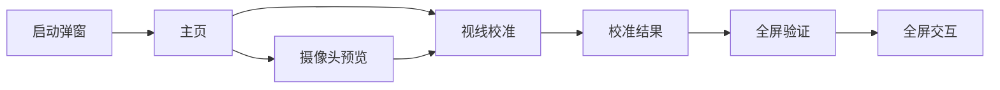
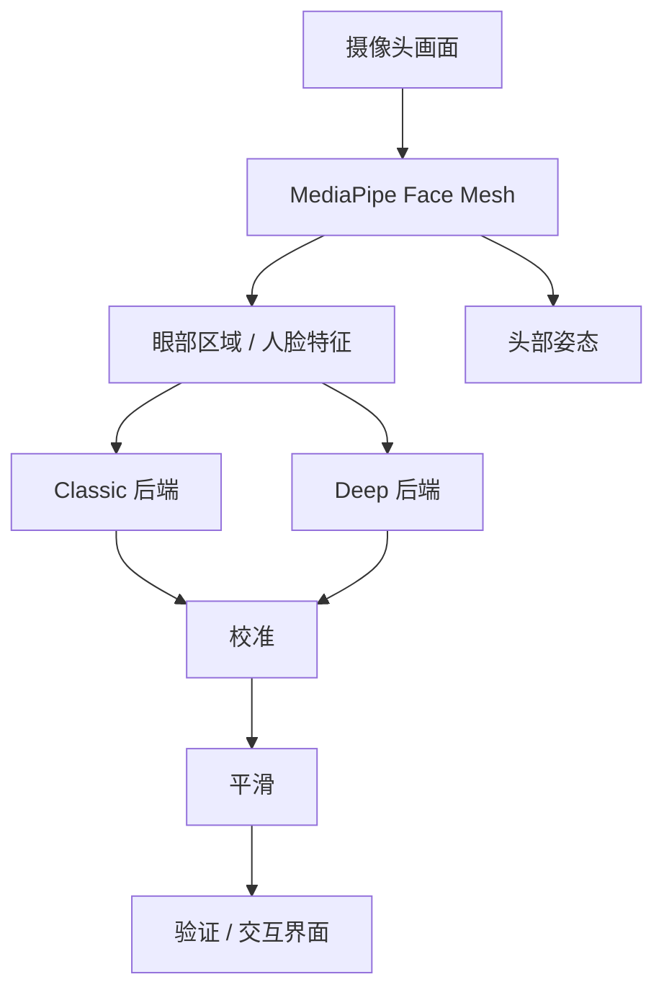
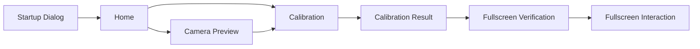
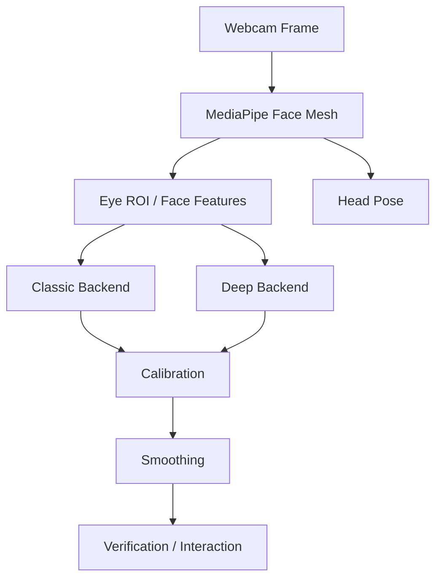

# Look2Act Tracker

<div align="center">

**基于普通摄像头的视线驱动交互系统**

[](https://www.python.org/)
[](https://www.riverbankcomputing.com/software/pyqt/)
[](https://onnxruntime.ai/)
[](https://pytorch.org/)
[](docs/project_status.md)

[English](#english)


</div>

Look2Act Tracker 是一个基于普通摄像头的视线驱动交互系统，提供启动配置、摄像头预览、视线校准、全屏验证和注视交互流程。系统支持 Classic 与 Deep 两种模式，便于在不同设备条件下进行演示、测试和研究。

## 功能特性

- 启动时选择界面语言和运行模式。
- 使用标准摄像头完成人脸检测、眼部区域提取和视线估计。
- 提供摄像头预览、校准、验证和全屏交互页面。
- 支持 Classic 与 Deep 两套 YAML 配置。
- 用户可变配置保存到当前用户的 AppData 目录，适合普通用户权限运行。
- 支持 Windows EXE 方式启动。

## 运行模式

| 模式 | 后端 | 配置 |
| --- | --- | --- |
| Classic | `classic` | `configs/classic.yaml` |
| Deep | `deep` | `configs/deep.yaml` |


## 快速开始

```bash
conda activate gaze-env
cd /d/Projects/Look2Act_Tracker_Project
python main.py
```

也可以直接指定配置文件：

```bash
python main.py --config configs/classic.yaml
python main.py --config configs/deep.yaml
```

启动后可在同一个弹窗中选择界面语言与运行模式：


## 使用流程




## 系统结构



## 数据采集

Look2Act Tracker 可以配合独立的数据采集系统使用。配套项目 [Gaze Dataset Collector](https://github.com/narmi924/gaze_dataset_collector) 面向数据采集者分发，构建产物为 `gaze_collector.exe`，安装后显示为 **Imran 的视线数据采集系统**。该采集系统用于生成训练和评估所需的数据，Tracker 项目负责模型训练、推理验证和交互演示。


## README 图片资源

后续补充图片或 GIF 时，请将文件放入 `readme-images/`，并使用以下文件名，README 会自动引用：

| 文件 | 用途 |
| --- | --- |
| `readme-images/hero-demo.gif` | 顶部主演示动图 |
| `readme-images/classic-demo.gif` | Classic 模式交互演示 |
| `readme-images/deep-demo.gif` | Deep 模式追踪演示 |
| `readme-images/startup-dialog.png` | 启动语言与模式选择弹窗 |
| `readme-images/calibration-flow.gif` | 摄像头预览、校准、保存流程 |
| `readme-images/tracking-interaction.gif` | 全屏验证与交互窗口 |
| `readme-images/collector-home.png` | 数据采集应用首页截图 |
| `readme-images/collector-samples.png` | 采集者真实采集样例 |

## 项目结构

```text
Look2Act_Tracker_Project/
├── configs/                  # 系统和模式 YAML 配置
├── docs/                     # 项目文档
├── readme-images/            # README 图片和 GIF
├── scripts/                  # 数据预处理、训练、导出和评估脚本
├── src/
│   ├── calibration/          # 校准拟合与序列化
│   ├── geometry/             # 屏幕几何与坐标计算
│   ├── models/               # GazeNet 模型
│   ├── tracker/              # 实时追踪管道和后端
│   ├── ui/                   # PyQt6 / QFluentWidgets 界面
│   └── vision/               # 人脸检测和头部姿态估计
├── tests/                    # 自动化测试
├── tools/                    # 打包和手动检查工具
├── Look2Act.ico              # Windows 应用图标
├── Look2Act.spec             # PyInstaller 打包配置
├── main.py                   # 应用入口
└── requirements.txt
```

## 训练与导出

训练阶段使用 PyTorch；Windows 演示应用默认使用 ONNX Runtime 推理。

```bash
conda activate gaze-env
python scripts/preprocess.py
python scripts/train.py --config configs/train_config.yaml
python scripts/export_onnx.py --checkpoint checkpoints/best_model.pth --output checkpoints/gaze_net.onnx
python scripts/evaluate.py --checkpoint checkpoints/best_model.pth
```

## 测试

```bash
conda run --no-capture-output -n gaze-env python -m pytest
```

在 Windows PowerShell 中，如果 `conda` alias 不可用，可使用：

```powershell
& 'C:\ProgramData\anaconda3\Scripts\conda.exe' run --no-capture-output -n gaze-env python -m pytest
```

## 作者

依木热尼江·买买提明 / Imranjan Mamtimin  
https://imranjan.cn

<a id="english"></a>

---

# Look2Act Tracker

<div align="center">

**Gaze-driven interaction with a standard webcam**

[中文](#look2act-tracker)


</div>

Look2Act Tracker is a webcam-based gaze-driven interaction system. It provides startup configuration, camera preview, gaze calibration, fullscreen verification, and gaze interaction workflows. The system supports Classic and Deep modes for demonstration, testing, and research across different device conditions.

## Features

- Select UI language and running mode at startup.
- Use a standard webcam for face detection, eye-region extraction, and gaze estimation.
- Provide camera preview, calibration, verification, and fullscreen interaction pages.
- Support Classic and Deep YAML configurations.
- Store user-editable configuration in the current user's AppData directory.
- Support Windows EXE startup.

## Modes

| Mode | Backend | Config |
| --- | --- | --- |
| Classic | `classic` | `configs/classic.yaml` |
| Deep | `deep` | `configs/deep.yaml` |


## Quick Start

```bash
conda activate gaze-env
cd /d/Projects/Look2Act_Tracker_Project
python main.py
```

You can also launch with a specific config:

```bash
python main.py --config configs/classic.yaml
python main.py --config configs/deep.yaml
```

The startup dialog lets you choose the UI language and running mode:


## User Flow




## Architecture



## Data Collection

Look2Act Tracker can be used together with an independent data collection system. The companion project [Gaze Dataset Collector](https://github.com/narmi924/gaze_dataset_collector) is distributed to data collectors, builds as `gaze_collector.exe`, and is installed as **Imran's Gaze Data Collection System**. The collection system generates data for training and evaluation, while this Tracker project handles model training, runtime verification, and interaction demos.


## README Media Assets

Place future images or GIFs in `readme-images/` using the following filenames. This README already references them:

| File | Usage |
| --- | --- |
| `readme-images/hero-demo.gif` | Main demo GIF at the top |
| `readme-images/classic-demo.gif` | Classic mode interaction demo |
| `readme-images/deep-demo.gif` | Deep mode tracking demo |
| `readme-images/startup-dialog.png` | Startup language and mode dialog |
| `readme-images/calibration-flow.gif` | Camera preview, calibration, and save flow |
| `readme-images/tracking-interaction.gif` | Fullscreen verification and interaction windows |
| `readme-images/collector-home.png` | Data collection app home screenshot |
| `readme-images/collector-samples.png` | Real participant collection samples |

## Repository Structure

```text
Look2Act_Tracker_Project/
├── configs/                  # System and mode YAML configs
├── docs/                     # Project documents
├── readme-images/            # README images and GIFs
├── scripts/                  # Preprocessing, training, export, and evaluation scripts
├── src/
│   ├── calibration/          # Calibration fitting and serialization
│   ├── geometry/             # Screen geometry and coordinate computation
│   ├── models/               # GazeNet models
│   ├── tracker/              # Runtime pipeline and backends
│   ├── ui/                   # PyQt6 / QFluentWidgets interface
│   └── vision/               # Face detection and head-pose estimation
├── tests/                    # Automated tests
├── tools/                    # Packaging and manual check tools
├── Look2Act.ico              # Windows application icon
├── Look2Act.spec             # PyInstaller packaging config
├── main.py                   # Application entry
└── requirements.txt
```

## Training And Export

Training uses PyTorch. The Windows demo application uses ONNX Runtime for inference by default.

```bash
conda activate gaze-env
python scripts/preprocess.py
python scripts/train.py --config configs/train_config.yaml
python scripts/export_onnx.py --checkpoint checkpoints/best_model.pth --output checkpoints/gaze_net.onnx
python scripts/evaluate.py --checkpoint checkpoints/best_model.pth
```

## Tests

```bash
conda run --no-capture-output -n gaze-env python -m pytest
```

If the `conda` alias is not available in Windows PowerShell, use:

```powershell
& 'C:\ProgramData\anaconda3\Scripts\conda.exe' run --no-capture-output -n gaze-env python -m pytest
```

## Author

Imranjan Mamtimin  
https://imranjan.cn
