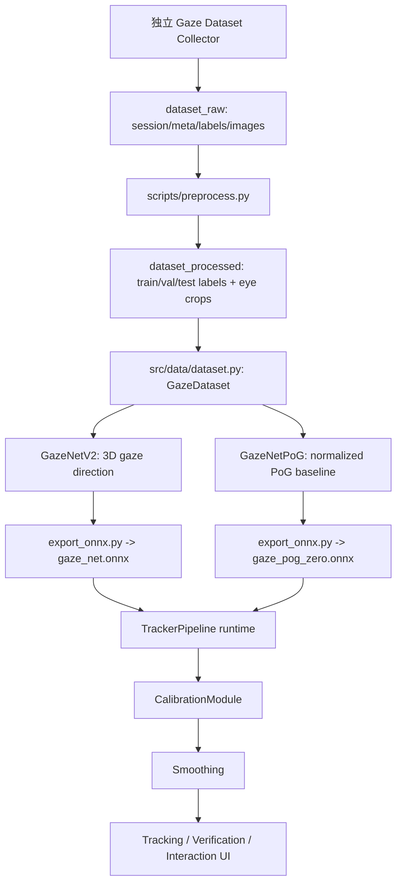
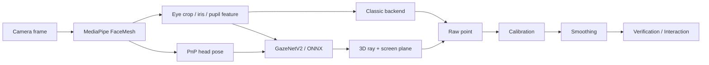

# Look2Act 论文写作总览与事实口径

生成日期：2026-05-07  
目标：把 `README.md`、`docs/`、`evaluation_results/`、`logs/` 与关键代码实现整合成一份论文写作主文档。写论文时建议先看 `README.md`，再看本文档；其他文档只在需要追溯实验细节时打开。

## 0. 先读结论

Look2Act Tracker 是一个基于普通 RGB 摄像头的桌面视线驱动交互系统。项目现在有两条路线：

| 路线 | 当前定位 | 是否适合作为论文主线 | 是否适合演示 | 当前事实口径 |
| --- | --- | --- | --- | --- |
| Classic Demo | 工程体验兜底线，Eye_Touch 风格经典图像处理 | 作为系统完整性和 demo 路线写，不作为深度模型贡献 | 是，当前默认稳定路线 | `classic` 后端 + 5x5 polynomial 校准 + Kalman/历史均值平滑 |
| Deep 3D Demo | 机器学习研究线，GazeNetV2 输出 3D gaze，再投影到屏幕 | 是，作为模型、几何契约、离线实验和诊断主线 | 可演示但对头部运动敏感 | 当前最佳契约是 `camera-space + zero origin + 720mm + pose zero + swapped eye input + EMA` |
| Deep PoG | 直接回归屏幕归一化点的 baseline | 作为对照或失败分析写 | 暂不作为主要演示路线 | 离线可学但实时拓扑不稳，`deep_pog_zero` 测试均值 221.8 px |

论文中最稳妥的主叙事是：

> Look2Act 面向普通笔记本摄像头，构建了从数据采集、轻量 gaze 模型、屏幕几何投影、用户校准、时序平滑到全屏交互的完整系统。实验表明 GazeNetV2 在 31 用户、7395 样本的 Leave-One-User-Out 评估中达到 2.48° 平均角度误差；但从角度估计到实时屏幕交互之间仍存在几何契约和实时域差异，项目通过 3D gaze-to-screen 契约诊断定位并修复了旧 head-space/PnP runtime 假设导致的拓扑折叠问题。

不要把当前论文写成“我们已经实现鲁棒头动补偿的高精度眼动仪”。更准确的定位是“低成本普通摄像头 gaze interaction system + 系统级链路分析 + 可部署实现 + 深度路线的契约诊断”。

## 1. 事实来源和日期优先级

项目里有些文档较早，但仍有可用实验结果；有些旧叙事已被 2026-05-06 的诊断推翻。写论文时按下面优先级判断。

| 优先级 | 来源 | 日期/状态 | 如何使用 |
| --- | --- | --- | --- |
| 最高 | `docs/project_status.md` | 2026-05-06 | 当前总状态、演示路线、Deep 最新有效配置 |
| 最高 | `docs/research/3d_gaze_to_screen_stage_summary_2026-05-06.md` | 2026-05-06 | Deep 3D runtime 契约的最终口径 |
| 最高 | `docs/research/3d_contract_runtime_repair_2026-05-06.md` | 2026-05-06 | 3D 契约修复过程和关键实验事实 |
| 高 | `docs/look2act_recovery_status.md` | 2026-05-06 | Classic/Deep 恢复状态、已跑短测试、标签审计结论 |
| 高 | `evaluation_results/**` | 评估产物 | 指标与图表事实，优先于旧文字表述 |
| 高 | `src/**`、`scripts/**`、`configs/**` | 当前代码 | 方法实现事实，优先于旧研究设想 |
| 中 | `docs/logs/experiment_log.md` | 2026-03 到 2026-04 | 历史实验记录；其中 2026-03-30、2026-04-05 的 V2/LOO 结果仍是论文主结果 |
| 中 | `docs/logs/paper_notes.md` | 2026-04-06 | 论文结构建议仍有价值，但 Deep runtime 口径需按 2026-05-06 更新 |
| 中低 | `docs/research/LOOK2ACT_RESEARCH_README.md` | 较早 | 数学表达、系统结构可参考；其中 head-local/PnP 默认链路已经过时 |
| 中低 | `docs/midterm/**` | 中期材料 | 答辩表达、示意图可参考；数字和结论需重新核对 |

特别注意：

- 当前工作区的 `dataset_raw/` 和 `dataset_processed/` 目录为空，因此本文的数据规模来自 `evaluation_results/label_audit/summary.json`、`evaluation_results/error_analysis/summary.json`、`evaluation_results/leave_one_out_resume/summary.json` 等历史评估产物，而不是现场重新扫描数据目录。
- `readme-images/` 当前只有 `.gitkeep`，README 引用的 GIF/PNG 在工作区不存在。论文插图应优先使用 `evaluation_results/` 和 `docs/midterm/images/`。
- 旧文档里“head-local gaze + PnP rotation”只能作为历史假设或失败诊断写；当前 Deep Demo 不能再按这个口径描述。

## 2. 项目时间线

| 日期 | 阶段 | 关键事实 | 当前论文使用方式 |
| --- | --- | --- | --- |
| 2026-03-16 | 校准、误差、平滑、头姿消融 | 建立早期实验矩阵：校准点数、误差分桶、EMA/OneEuro、head pose on/off | 保留为系统分析实验，但数值以当前 `evaluation_results/` 为准 |
| 2026-03-17 | 10 用户 LOO | 早期跨用户平均 5.03° | 只作为历史对比，不作为最终主结果 |
| 2026-03-24 到 2026-03-30 | GazeNetV2 | 单眼 V1 升级为双眼共享 CNN + head pose 融合；测试集 2.82° | 模型结构和离线性能主结果 |
| 2026-04-05 | 31 用户 LOO | 31 用户、7395 样本，跨用户平均 2.48° ±1.35° | 最重要的泛化主结果 |
| 2026-05-05 到 2026-05-06 | Deep/Classic 恢复 | Classic 成为 demo 兜底；Deep 开始从实时拓扑失败中恢复 | 系统状态与研究动机 |
| 2026-05-06 | 3D 契约修复 | 确认 camera-space + zero origin + 720mm + pose zero + swap + EMA 是当前可用 Deep runtime 契约 | Deep runtime 最新口径和讨论重点 |
| 2026-05-07 | README/打包/UI 整理 | README 更新为 Classic/Deep 双模式，EXE 打包方案形成 | 工程实现与交付章节 |

## 3. 当前完整数据链路



### 3.1 原始采集

配套项目 Gaze Dataset Collector 负责采集。根据 `docs/research/LOOK2ACT_RESEARCH_README.md` 和 `docs/research/deep_gaze_recovery_experiments_2026-05-05_06.md`，原始数据每个 session 包含：

- `meta.json`：屏幕、相机、设备等元数据。
- `labels.csv`：目标点、屏幕尺寸、头部姿态、距离代理值等。
- `images/*.jpg`：隐私合成图，布局为左眼、右眼、ArUco marker、骨架图。

当前工作区不保留实际原始数据文件，但评估产物显示项目曾使用 31 users / 7395 samples 的处理后数据。

### 3.2 预处理

核心代码：

- `scripts/preprocess.py`
- `src/data/preprocessing.py`
- `src/data/pipeline.py`

主要操作：

1. 从 Collector 合成图中提取左右眼 128x128 图像。
2. 计算屏幕目标归一化坐标：

   $$
   x_n = \frac{x}{W}, \qquad y_n = \frac{y}{H}
   $$

3. 根据屏幕物理尺寸和相机到屏幕距离生成 camera-space 3D gaze label。代码中的默认坐标约定是相机坐标系：X 向右，Y 向下，Z 向前。

   $$
   X = \frac{x}{W} W_{mm} - \frac{W_{mm}}{2}
   $$

   $$
   Y = c_{above} + \frac{y}{H} H_{mm}
   $$

   $$
   Z = d
   $$

   $$
   \mathbf{g} = \frac{[X,Y,Z]^T}{\|[X,Y,Z]^T\|_2}
   $$

4. 生成 `train/val/test` 数据集。根据 `evaluation_results/label_audit/summary.json`：

| split | samples | gaze norm | target out-of-bounds | head_pitch abs > 90 ratio |
| --- | ---: | ---: | ---: | ---: |
| train | 5018 | 1.0 | 0.0 | 0.9998 |
| val | 987 | 1.0 | 0.0 | 1.0 |
| test | 1390 | 1.0 | 0.0 | 1.0 |
| total | 7395 | 1.0 | 0.0 | 接近 1.0 |

解释：3D gaze label 是单位向量，屏幕目标点都在 `[0,1]` 范围内；但 head_pitch 的欧拉角约定异常明显，导致不能直接把当前标签重新解释为 head-local gaze。

## 4. 运行时系统链路



### 4.1 启动与 UI

入口：`main.py`

主窗口：`src/ui/main_window.py`

页面：

- `HomePage`：主页入口。
- `CameraPage`：摄像头预览和人脸检测可视化。
- `CalibrationPage`：全屏校准采样、拟合、保存。
- `TrackingPage`：启动/停止追踪、加载校准、诊断信息、打开验证和交互窗口。
- `SettingsPage`：摄像头、模型、几何、校准、平滑、后端配置。
- `InteractionLauncherOverlay` 和 `GomokuWindow`：全屏九宫格操作和五子棋交互 demo。

### 4.2 TrackerPipeline

核心文件：`src/tracker/pipeline.py`

`TrackerPipeline.process_frame()` 的当前逻辑：

1. 摄像头取帧。
2. `FaceDetector.detect()` 获取眼部 crop、PnP 点、iris/pupil/ROI 信息。
3. 如果 backend 是 `classic`，直接走 classic pupil feature。
4. 如果 backend 是 `deep` 或 `deep_pog`，估计 PnP head pose。
5. 准备左右眼输入，按配置可做 `normal/swap/flip/swap_flip`。
6. ONNX Runtime 或 PyTorch 推理。
7. `deep_pog`：模型输出 `[x_n,y_n]`，直接映射为屏幕像素。
8. `deep`：模型输出 3D direction，构造射线并与屏幕平面求交。
9. 校准模式下跳过 smoother 并保留 raw point；验证/交互阶段再平滑。

### 4.3 Classic 后端

核心文件：`src/tracker/classic.py`

Classic 后端不使用 CNN 权重，主要流程是：

1. MediaPipe 提供眼部 ROI。
2. `detect_pupil_centroid()` 使用灰度、Otsu 反向阈值、形态学和轮廓矩估计暗色瞳孔质心；失败时用暗像素加权质心。
3. `absolute_pupil_point()` 把 ROI 内质心转回相机坐标。
4. `fuse_eye_features()` 融合左右眼并归一化到相机画面 `[0,1]`。
5. 通过 5x5 polynomial 校准映射到屏幕。
6. 使用 Kalman + 历史均值做屏幕空间平滑。

定位：Classic 是演示兜底线，不是论文深度模型主贡献，但可以作为系统完整性和人机交互 demo。

### 4.4 Deep 3D 后端

模型：`GazeNetV2`  
权重：`checkpoints/best_model.pth`、`checkpoints/gaze_net.onnx`  
推荐配置：`configs/experiments/system_deep_demo.yaml`

当前有效配置：

```yaml
tracker.backend: deep
model.use_onnx: true
model.deep_gaze_space: camera
model.deep_pose_input: zero
model.deep_ray_origin: zero_origin
model.deep_eye_input_mode: swap
geometry.screen_distance_mm: 720.0
calibration.num_points: 25
smoother.type: ema
smoother.alpha: 0.22
```

这意味着当前 Deep Demo 不再采用旧的 `head-space + PnP rotation + face translation + 500mm` 默认链路。旧链路在 `evaluation_results/3d_contract_runtime/variant_summary.csv` 中表现为 head-space variants valid ratio 为 0。

## 5. 数学方法整理

### 5.1 模型输出

GazeNetV2 的输入为：

$$
\mathbf{I}_L,\mathbf{I}_R \in \mathbb{R}^{3 \times 128 \times 128}, \qquad
\mathbf{h} = [yaw,pitch,roll]^T
$$

共享 CNN 分别提取左右眼特征：

$$
\mathbf{z}_L = \phi(\mathbf{I}_L), \qquad \mathbf{z}_R = \phi(\mathbf{I}_R)
$$

融合后回归 3D gaze：

$$
\tilde{\mathbf{g}} = \psi([\mathbf{z}_L,\mathbf{z}_R,\mathbf{h}])
$$

输出归一化为单位向量：

$$
\mathbf{g} = \frac{\tilde{\mathbf{g}}}{\|\tilde{\mathbf{g}}\|_2}
$$

对应代码：`src/models/gaze_net.py`。

### 5.2 角度损失

3D gaze 训练使用 angular loss：

$$
\mathcal{L}_{angle}
= \frac{1}{N}\sum_i
\arccos(\operatorname{clamp}(\mathbf{g}_i^{pred}\cdot \mathbf{g}_i^{true}, -1+\epsilon, 1-\epsilon))
$$

对应代码：`src/models/losses.py`。损失单位是弧度，评估时转成度。

### 5.3 PnP 头部姿态

`src/vision/head_pose.py` 使用 6 个 2D 面部关键点与简化 3D 人脸模型点，通过 `cv2.solvePnP()` 求解旋转和平移：

$$
s \mathbf{u}_i = K [R|t] \mathbf{X}_i
$$

得到旋转矩阵 \(R\)、平移向量 \(t\) 以及 yaw/pitch/roll。注意：当前数据审计显示 stored Euler 角存在约定问题，因此当前 Deep Demo 默认把模型姿态输入置零，并且 runtime 不默认把 gaze 当 head-local 后再乘 PnP rotation。

### 5.4 3D gaze 到屏幕点

旧 head-space 链路：

$$
\mathbf{d}_{cam} = R \mathbf{g}_{local}, \qquad \mathbf{o} = t
$$

当前 Deep Demo camera-space 链路：

$$
\mathbf{d}_{cam} = \mathbf{g}_{camera}, \qquad \mathbf{o} = [0,0,0]^T
$$

射线：

$$
\mathbf{P}(\lambda)=\mathbf{o}+\lambda \mathbf{d}
$$

屏幕平面：

$$
\mathbf{n}\cdot(\mathbf{P}-\mathbf{P}_0)=0
$$

交点参数：

$$
\lambda = \frac{\mathbf{n}\cdot(\mathbf{P}_0-\mathbf{o})}{\mathbf{n}\cdot\mathbf{d}}
$$

当 \(|\mathbf{n}\cdot\mathbf{d}|\) 过小或 \(\lambda < 0\) 时无有效交点。

对应代码：

- `src/geometry/ray_plane.py`
- `src/geometry/screen_geometry.py`
- `src/tracker/pipeline.py::_compute_deep_ray()`

### 5.5 屏幕局部坐标到像素

交点 \(\mathbf{P}\) 相对屏幕左上角 \(\mathbf{P}_0\) 的局部坐标：

$$
x_{mm} = (\mathbf{P}-\mathbf{P}_0)\cdot \mathbf{e}_x
$$

$$
y_{mm} = (\mathbf{P}-\mathbf{P}_0)\cdot \mathbf{e}_y
$$

像素坐标：

$$
p_x = \frac{x_{mm}}{W_{mm}} W_{px}, \qquad
p_y = \frac{y_{mm}}{H_{mm}} H_{px}
$$

运行时非校准模式会 clamp 到屏幕范围；校准模式不会 clamp，以免污染拟合。

### 5.6 校准映射

校准模块：`src/calibration/calibrator.py`

Affine：

$$
\begin{bmatrix}
x'\\y'
\end{bmatrix}
=
A
\begin{bmatrix}
x\\y\\1
\end{bmatrix}, \qquad A\in\mathbb{R}^{2\times3}
$$

Polynomial：

$$
\begin{bmatrix}
x'\\y'
\end{bmatrix}
=
W
\begin{bmatrix}
x\\y\\xy\\x^2\\y^2\\1
\end{bmatrix}, \qquad W\in\mathbb{R}^{2\times6}
$$

参数通过最小二乘求解：

$$
\min_A \sum_i \|h(\mathbf{p}_i^{raw})-\mathbf{p}_i^{target}\|_2^2
$$

当前实现会先对 raw 点归一化，增强 polynomial 数值稳定性。Classic 和 deep_pog 默认 25 点 polynomial；deep 若显式 `num_points >= 25` 也会使用 polynomial，否则 9 点 affine。

### 5.7 平滑

EMA：

$$
\mathbf{s}_t = \alpha \mathbf{x}_t + (1-\alpha)\mathbf{s}_{t-1}
$$

Classic 还实现了 Kalman 常速度平滑器，并叠加历史均值。当前 Deep Demo 用 EMA，Classic Demo 用 Kalman。

## 6. 模型与后端对照

| 名称 | 输入 | 输出 | 损失/方法 | 当前角色 | 文件 |
| --- | --- | --- | --- | --- | --- |
| GazeNet V1 | 单眼 128x128 | 3D 单位 gaze | angular loss | 早期基线 | `src/models/gaze_net.py` |
| GazeNetV2 | 左眼 + 右眼 + head pose | 3D 单位 gaze | angular loss | 深度研究主模型 | `src/models/gaze_net.py` |
| GazeNetPoG | 左眼 + 右眼 + head pose/zero pose | 2D normalized PoG | Smooth L1 | direct PoG baseline | `src/models/gaze_net.py` |
| Classic Tracker | pupil/iris/camera feature | raw 2D feature | calibration-driven | 演示兜底线 | `src/tracker/classic.py` |

GazeNetV2 结构要点：

- 左右眼共享 CNN backbone：Conv-BN-ReLU-MaxPool 四层。
- 单眼特征维度 256，左右眼合计 512。
- 拼接 3 维 head pose，融合输入 515 维。
- `Linear(515 -> 128) + ReLU + Dropout(0.3) + Linear(128 -> 3)`。
- 输出 L2 normalize。
- 参数量记录约 455,811，属于轻量模型。

## 7. 训练配置与训练日志

主 3D 模型配置：`configs/train_config.yaml`

| 参数 | 值 |
| --- | --- |
| model | GazeNetV2 |
| channels | [32, 64, 128, 256] |
| input size | 128 |
| output | 3D gaze vector |
| batch size | 64 |
| learning rate | 0.001 |
| epochs | 100 |
| optimizer | Adam |
| scheduler | CosineAnnealingLR |
| weight decay | 0.0001 |
| device | Intel XPU + IPEX |

`logs/training_log.csv` 显示：

- 训练 100 epochs。
- 最佳验证角度约 2.02°，出现在 epoch 75 附近。
- epoch 100 验证角度约 2.08°。

Direct PoG zero 配置：`configs/train_pog_config.yaml`

- model version: `pog_v1`
- target mode: `pog2d`
- head pose mode: `zero`
- checkpoint: `checkpoints/deep_pog_zero`
- log: `logs/deep_pog_zero/training_log.csv`

`deep_pog_zero` 训练日志最佳验证像素误差约 206.6 px；但最终是否能交互不能只看验证像素误差，还必须看实时校准 raw topology。

## 8. 实验结果总表

### 8.1 数据审计

来源：`evaluation_results/label_audit/summary.json`

| 指标 | 结果 | 论文含义 |
| --- | ---: | --- |
| total samples | 7395 | 当前主数据规模 |
| train/val/test | 5018 / 987 / 1390 | 固定划分评估 |
| target out-of-bounds ratio | 0.0 | 屏幕标签范围合法 |
| gaze norm mean | 1.0 | 3D gaze label 是单位向量 |
| head_pitch abs > 90 ratio | train 0.9998, val/test 1.0 | 不能直接信任 Euler 角做 head-local relabel |
| head-local negative z ratio | 接近/等于 1.0 | 现有 camera-space label 不能直接反转成 head-local label |

### 8.2 GazeNetV2 固定划分评估

来源：

- `evaluation_results/metrics.json`
- `evaluation_results/error_analysis/summary.json`

| 指标 | 结果 |
| --- | ---: |
| test samples | 1390 |
| test mean angle error | 2.82° |
| test median angle error | 1.98° |
| test mean pixel error | 314.5 px |
| all-split mean angle error | 1.60° |
| train / val / test mean angle | 1.17° / 2.06° / 2.82° |

可写结论：V2 在固定测试集上方向估计已经比较稳定，但屏幕像素误差仍然较高，说明剩余瓶颈在几何投影、屏幕距离、校准、实时域差异，而不是单纯 gaze direction 学不会。

### 8.3 Leave-One-User-Out 泛化

来源：`evaluation_results/leave_one_out_resume/summary.json`

| 指标 | 旧 10 用户 LOO | 当前 31 用户 LOO |
| --- | ---: | ---: |
| users | 10 | 31 |
| samples | 2193 | 7395 |
| mean angle error | 5.03° ±1.64° | 2.48° ±1.35° |
| mean pixel error | 349.5 ±17.4 px | 321.4 ±19.9 px |
| best user | User 14, 3.34° | User 81, 0.93° |
| worst user | User 5, 9.30° | User 5, 6.96° |
| <= 3° users | 未统计 | 23/31 |

论文主结果应使用 31 用户 LOO，不要继续引用 10 用户 5.03° 作为最终性能。

### 8.4 校准点数与校准函数

来源：`evaluation_results/calibration_compare/results.json`

| 方法 | 点数 | hold-out mean px | median px | P90 px | 结论 |
| --- | ---: | ---: | ---: | ---: | --- |
| none | 0 | 314.5 | 320.8 | 479.6 | 无校准 baseline |
| affine | 1 | 409.6 | 404.0 | 664.7 | 单点平移在该设置下更差 |
| affine | 3 | 4608.4 | 4137.6 | 8485.8 | 严重过拟合/退化，不应主推 |
| affine | 5 | 295.7 | 251.4 | 569.5 | 有改善但方差大 |
| affine | 9 | 221.2 | 185.7 | 416.5 | 该离线实验最稳定 |
| polynomial | 9 | 437.0 | 318.9 | 979.1 | fit 低但 hold-out 差，过拟合 |

注意：这个实验是离线 9 点/少点校准对比，不等同于 2026-05-06 Deep Demo 的 25 点实时 polynomial 校准。论文可以把它写成“少量校准点的 hold-out 泛化分析”，不要用它替代当前实时配置。

### 8.5 Head pose 消融

来源：`evaluation_results/head_pose_ablation/summary.json`

| 条件 | mean pixel error | median pixel error | 说明 |
| --- | ---: | ---: | --- |
| full_pose | 365.0 px | 369.6 px | 旧几何消融中最优 |
| no_pose | 501.9 px | 515.7 px | 无旋转更差 |
| no_yaw | 365.0 px | 369.6 px | yaw 在当前数据影响很小 |
| no_pitch | 496.7 px | 504.6 px | pitch 贡献明显 |

历史结论：在旧投影假设里，head pose 几何补偿可降低约 27.3% 像素误差。

当前修正：2026-05-06 的 3D runtime 诊断进一步发现，现有 label/runtime 契约下 head-space rotation 在真实 runtime 会导致无效或折叠；所以这个消融只能说明“姿态/几何因素重要”，不能再证明当前 Deep Demo 应该使用 live PnP rotation。

### 8.6 Direct PoG baseline

来源：

- `evaluation_results/deep_pog/metrics.json`
- `evaluation_results/deep_pog_zero/metrics.json`
- `docs/research/deep_gaze_recovery_experiments_2026-05-05_06.md`

| 模型 | mean px | median px | P95 px | mean norm error | 当前解释 |
| --- | ---: | ---: | ---: | ---: | --- |
| deep_pog | 248.8 | 161.8 | 790.9 | 0.1618 | 直接 PoG baseline |
| deep_pog_zero | 221.8 | 148.6 | 703.3 | 0.1498 | zero pose 改善离线指标 |

Direct PoG 的问题不是完全学不会，而是实时 25 点校准时 raw topology 仍可能压缩/折叠。论文可将其作为“直接屏幕点回归的对照路线”，但当前不宜作为主 demo 成果。

### 8.7 3D gaze-to-screen 契约诊断

来源：

- `evaluation_results/3d_contract_runtime/variant_summary.csv`
- `docs/research/3d_contract_runtime_repair_2026-05-06.md`
- `docs/research/3d_gaze_to_screen_stage_summary_2026-05-06.md`

关键离线 variant：

| variant | valid | in-screen | mean px | median px | P95 px | area ratio | corr_x | corr_y |
| --- | ---: | ---: | ---: | ---: | ---: | ---: | ---: | ---: |
| camera + zero origin + dataset median | 1.0 | 1.0 | 216.2 | 150.0 | 688.2 | 0.883 | 0.663 | 0.714 |
| camera + zero origin + fixed 720mm | 1.0 | 1.0 | 216.5 | 150.0 | 688.8 | 0.886 | 0.663 | 0.714 |
| camera + zero origin + fixed 500mm | 1.0 | 1.0 | 299.7 | 259.3 | 662.6 | 0.428 | 0.663 | 0.714 |
| camera + face translation + 720mm | 1.0 | 1.0 | 589.1 | 605.4 | 885.2 | 0.035 | 0.663 | 0.714 |
| head-space rotation variants | 0.0 | 0.0 | 无有效 | 无有效 | 无有效 | 0.0 | 0.0 | 0.0 |

实时修复结论：

- `swap` 是关键突破，说明训练/实时左右眼输入语义存在错位。
- `swap + EMA 修复后` 达到 residual 152.33 px，验证阶段可用。
- `swap_live` 会在轻微转头时压缩上下方向，因此 live head pose 暂不作为默认演示输入。
- 校准阶段必须采 raw point，不能让 EMA/Kalman 污染拟合点。

### 8.8 平滑实验

来源：`evaluation_results/smoothing_compare/results.json`

| 平滑器 | jitter | fixation jitter | RMSE | latency proxy | 解释 |
| --- | ---: | ---: | ---: | ---: | --- |
| none / EMA α=1.0 | 26.0 | 23.2 | 41.2 | 40.1 | 抖动大 |
| EMA α=0.1 | 5.6 | 1.8 | 62.4 | 166.4 | 很稳但延迟大 |
| EMA α=0.2 | 6.9 | 3.6 | 33.6 | 91.2 | 接近当前 Deep Demo α=0.22 |
| EMA α=0.3 | 8.2 | 5.5 | 24.7 | 56.9 | 旧默认折中 |
| 1Euro mc=0.5 β=0.005 | 12.9 | 6.8 | 20.5 | 31.4 | 合成实验 RMSE 最优 |

论文可写：平滑存在稳定性和响应速度权衡；当前系统用简单 EMA/Kalman 是工程稳妥选择，OneEuro 可作为未来优化方向。

## 9. 可用图表清单

### 9.1 最推荐放入论文正文

| 图 | 路径 | 建议用途 | 注意事项 |
| --- | --- | --- | --- |
| 系统端到端流程图 | `docs/midterm/images/G5-实时视线追踪系统端到端流程架构图.jpg` | 方法章节 Fig.1 | 需确认图中文字和最新 Deep 契约一致；若仍写 head-local，需要重画或改图注 |
| GazeNetV2 结构图 | `docs/midterm/images/G4-GazeNetV2 模型结构与信息融合示意图.png` | 模型结构 Fig.2 | 可用，需图注强调双眼共享 CNN + pose 融合 |
| 数据采集与处理流程 | `docs/midterm/images/G3-自建数据采集与数据处理流程图.jpg` | 数据集章节 | 可用，注意当前仓库不含实际数据目录 |
| 31 用户 LOO 角度误差 | `evaluation_results/leave_one_out_resume/loo_angle_error_per_user.png` | 主结果图 | 使用最新 31 用户版本，不要用旧 `leave_one_out/` |
| 校准点数与误差 | `evaluation_results/calibration_compare/calib_points_vs_error.png` | 校准实验图 | 说明是离线 hold-out 实验 |
| 误差热图 | `evaluation_results/error_analysis/screen_error_heatmap.png` | 误差分析图 | 适合展示屏幕区域误差分布 |
| target vs prediction | `evaluation_results/error_analysis/target_vs_prediction.png` | 模型预测分布 | 可展示偏差和覆盖范围 |
| 3D/PoG target vs prediction | `evaluation_results/deep_pog_zero/pog_target_vs_prediction.png` | Direct PoG baseline | 作为对照或附录 |

### 9.2 推荐放附录或答辩

| 图 | 路径 | 用途 |
| --- | --- | --- |
| `evaluation_results/head_pose_ablation/ablation_pixel_error_comparison.png` | head pose 历史消融 |
| `evaluation_results/head_pose_ablation/ablation_error_vs_pitch.png` | pitch 影响分析 |
| `evaluation_results/head_pose_ablation/ablation_error_vs_yaw.png` | yaw 影响分析 |
| `evaluation_results/smoothing_compare/smoothing_summary.png` | 平滑策略比较 |
| `evaluation_results/smoothing_compare/jitter_vs_latency.png` | 抖动-延迟权衡 |
| `evaluation_results/smoothing_compare/trajectory_comparison.png` | 平滑轨迹示意 |
| `evaluation_results/error_analysis/error_vs_user.png` | 用户差异分析 |
| `evaluation_results/error_analysis/error_vs_session.png` | session/设备差异分析 |
| `evaluation_results/deep_pog/pog_error_histogram.png` | PoG baseline 误差分布 |
| `evaluation_results/deep_pog_zero/pog_error_histogram.png` | PoG zero baseline 误差分布 |

### 9.3 暂不建议直接放正文

| 资源 | 原因 |
| --- | --- |
| `readme-images/*` | 当前工作区实际不存在 README 引用的图片/GIF |
| `evaluation_results/leave_one_out/*` | 旧 10 用户版本，已被 `leave_one_out_resume/` 取代 |
| 旧 head-local pipeline 图 | 会误导当前 Deep runtime 口径 |
| 仅展示 fit residual 的校准图 | 容易掩盖过拟合；论文应强调 hold-out error |

## 10. 论文可写贡献点

可以写成 3 到 4 条：

1. 提出并实现一个普通 RGB 摄像头桌面 gaze interaction 系统，覆盖数据采集、模型训练、几何投影、个性化校准、实时平滑和全屏交互。
2. 设计轻量 GazeNetV2：双眼共享 CNN + head pose 融合，输出 3D 单位视线方向，并可导出 ONNX 在 CPU runtime 中运行。
3. 在 31 用户、7395 样本上进行固定划分、Leave-One-User-Out、校准、head pose、平滑和误差分桶分析，证明系统在多数用户上具备可用的方向估计能力，同时揭示长尾用户和像素映射瓶颈。
4. 通过 3D gaze-to-screen 契约诊断，发现并修正旧 head-space/PnP runtime 假设与现有 label/runtime 不一致导致的拓扑折叠，形成当前可演示 Deep contract。

如果篇幅有限，第 4 条可以放 Discussion 或 System Diagnosis，而不是主贡献。

## 11. 不应写或需要降级的说法

| 不建议写法 | 推荐改法 |
| --- | --- |
| “系统已实现鲁棒头部运动补偿” | “头部姿态和几何因素显著影响误差，但当前实时 Deep Demo 对头动仍敏感” |
| “当前 Deep 模型预测 head-local gaze” | “当前有效 runtime contract 更接近 camera-space gaze-to-screen；head-local 是被诊断否定的旧假设” |
| “Direct PoG 已经可用于稳定交互” | “Direct PoG 离线误差可下降，但实时校准拓扑仍不稳定，作为 baseline/对照更合适” |
| “9 点 polynomial 更强” | “9 点 polynomial 在 hold-out 中过拟合；9 点 affine 在离线少点校准中更稳定” |
| “系统可精确点选任意小目标” | “更适合粗粒度区域选择、dwell-based control 和演示型 gaze interaction” |
| “数据集当前就在仓库中可复现” | “当前工作区不含数据文件，但保留了评估产物和统计结果；复现需重新放入数据或运行采集/预处理” |

## 12. 建议论文结构

### Abstract

写清：

- 普通摄像头、低成本、桌面交互。
- GazeNetV2 + 几何投影 + 校准 + 平滑。
- 31 用户 LOO 2.48°，固定测试集 2.82°。
- 系统仍受几何映射和实时契约影响，提出诊断/修复。

### Introduction

逻辑：

1. 视线交互有价值，但专业眼动仪成本高。
2. 普通 webcam 方案难点在于低质量图像、头姿、屏幕几何、用户差异、实时部署。
3. 很多工作只报告 gaze estimation，缺少从估计到交互的完整链路。
4. Look2Act 的目标是可运行系统和系统级分析。

### Related Work

分组：

- Appearance-based gaze estimation。
- Webcam/consumer-device gaze interaction。
- Calibration and personalization。
- Head pose and geometry-based projection。
- Lightweight deployment / ONNX / real-time systems。

### Method

建议小节：

1. System overview。
2. Data collection and preprocessing。
3. GazeNetV2 architecture。
4. 3D gaze-to-screen projection。
5. Calibration and smoothing。
6. Runtime backends and UI interaction flow。

### Experiments

建议实验表：

1. Dataset statistics and label audit。
2. Fixed split performance。
3. 31-user LOO。
4. Calibration comparison。
5. Head pose / geometry ablation。
6. Deep runtime contract diagnosis。
7. Smoothing trade-off。

### Discussion

重点写：

- 角度误差改善大于像素误差改善，说明几何/校准是剩余瓶颈。
- 长尾用户仍需要 personalization。
- Deep Demo 的恢复过程说明“模型离线有效”不等于“实时交互可用”，必须检查 label/runtime contract。
- Classic backend 的存在是工程兜底，不是对 Deep 路线的否定。

### Limitations

必须诚实写：

- 当前没有正式 HCI 用户实验指标，如 Fitts' Law、任务完成时间、长期疲劳。
- 当前实时 Deep 对头动敏感。
- 数据集不大于公开大规模 benchmark，但项目重点是端到端系统。
- 屏幕距离、相机内参、PnP 欧拉角约定仍需更严格建模。

## 13. 可复现命令索引

短检查：

```bash
conda run --no-capture-output -n gaze-env python -m pytest tests/test_calibration.py tests/test_smoother.py tests/test_tracker_pipeline.py
conda run --no-capture-output -n gaze-env python scripts/audit_gaze_labels.py
conda run --no-capture-output -n gaze-env python scripts/evaluate_pog.py --checkpoint checkpoints/deep_pog_zero/best_model.pth
```

训练和长评估需要用户手动运行，不建议在 Codex 中启动：

```bash
conda activate gaze-env
python scripts/preprocess.py
python scripts/train.py --config configs/train_config.yaml
python scripts/train.py --config configs/train_pog_config.yaml
python scripts/export_onnx.py --checkpoint checkpoints/best_model.pth --output checkpoints/gaze_net.onnx
python scripts/evaluate.py --checkpoint checkpoints/best_model.pth
python scripts/exp_leave_one_out.py --epochs 50 --device xpu
```

当前推荐演示：

```bash
conda activate gaze-env
python main.py --config configs/experiments/system_classic_demo.yaml
python main.py --config configs/experiments/system_deep_demo.yaml
```

## 14. 文件地图

| 类别 | 路径 | 说明 |
| --- | --- | --- |
| 当前状态 | `docs/project_status.md` | 最新项目状态 |
| 3D 契约 | `docs/research/3d_gaze_to_screen_stage_summary_2026-05-06.md` | Deep runtime 最新结论 |
| 3D 修复日志 | `docs/research/3d_contract_runtime_repair_2026-05-06.md` | 详细诊断记录 |
| 恢复状态 | `docs/look2act_recovery_status.md` | Classic/Deep 恢复和测试 |
| 实验日志 | `docs/logs/experiment_log.md` | 早期到 V2/LOO 实验 |
| 模型 | `src/models/gaze_net.py` | GazeNet, GazeNetV2, GazeNetPoG |
| 损失 | `src/models/losses.py` | angular loss |
| 数据 | `src/data/dataset.py`, `src/data/preprocessing.py` | Dataset 和 label 生成 |
| 人脸/头姿 | `src/vision/face_detector.py`, `src/vision/head_pose.py` | MediaPipe + PnP |
| 几何 | `src/geometry/*.py` | 坐标变换和 ray-plane |
| 校准 | `src/calibration/calibrator.py` | affine/polynomial calibration |
| 实时管道 | `src/tracker/pipeline.py` | Classic/Deep/PoG runtime |
| Classic | `src/tracker/classic.py` | pupil/iris feature |
| UI | `src/ui/*.py` | PyQt6/QFluentWidgets |
| 训练 | `scripts/train.py` | 训练入口 |
| 评估 | `scripts/evaluate.py`, `scripts/evaluate_pog.py`, `scripts/exp_*.py` | 实验脚本 |
| 结果 | `evaluation_results/**` | 指标 JSON/CSV 和图片 |
| 训练日志 | `logs/**/training_log.csv` | epoch 级训练曲线 |

## 15. 最终写作口径备忘

最应该记住的 10 个数字/事实：

1. 数据规模：31 users / 7395 samples。
2. 固定划分：train 5018、val 987、test 1390。
3. GazeNetV2 固定 test mean angle：2.82°。
4. GazeNetV2 固定 test mean pixel：314.5 px。
5. 31-user LOO mean angle：2.48° ±1.35°。
6. 31-user LOO mean pixel：321.4 ±19.9 px。
7. 23/31 用户 <= 3°。
8. 9-point affine hold-out：221.2 px，优于无校准 314.5 px。
9. 3D contract best offline：camera + zero origin + 720mm，mean 216.5 px。
10. 当前 Deep real-time 可用契约：camera-space + zero origin + 720mm + pose zero + swapped eyes + EMA，实时 residual 最低记录 152.33 px。

最稳妥的一句话：

> Look2Act 的核心价值不是单个模型指标，而是把普通摄像头 gaze estimation 真正接到屏幕几何、个人校准和交互界面中，并通过系统级实验说明这条链路在哪里有效、在哪里失效、如何修复。
